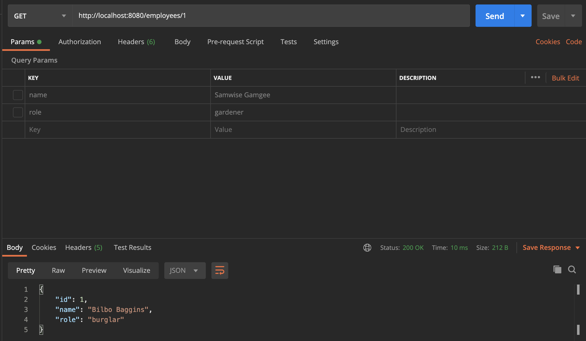
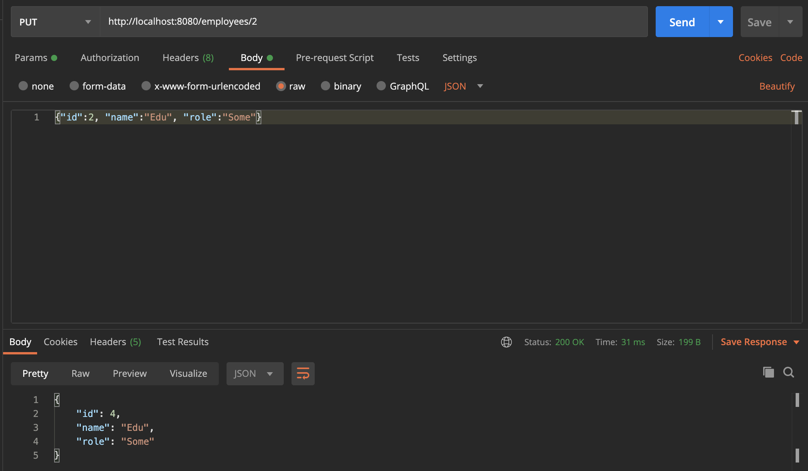
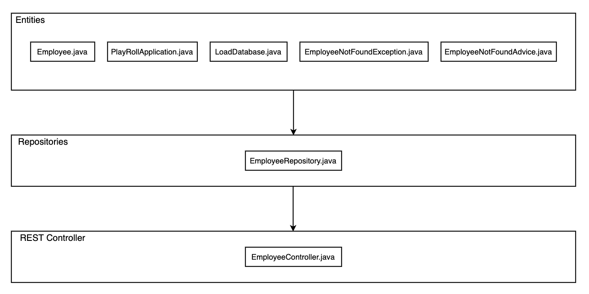

## 3.1

### c) What happens to your data when the application is stopped and restarted? How could you change that behavior? You don’t need to implement a solution; just explain it (with details).

When the application is restarted all the changes made by HTTP requests gets rolled back, this happens because, when the class `LoadDatabase` gets called, this inserts 2 employees innto the database. When the REST api is called, the data is stored in an instance of this, and not in the database.

### Be sure to list all, filter one, insert and update Employees, i.e., try the several web methods. Take note of the URL used and report in the Readme.
* GET requests (type: GET):
	* Allow us to list all employees:
		* URL: `http://localhost:8080/employees/`
	* Lists employee with id 1:
		* URL: `http://localhost:8080/employees/1`

* PUT request (type: PUT):
	* This will change the employee with id 2:
		* URL: `http://localhost:8080/employees/2`
		* Type: RAW - JSON
		* Content: `{"id":2, "name":"Edu", "role":"Some"}`

* POST request (type: POST):
	* This will add a new employee:
		* URL: `http://localhost:8080/employees/`
		* Type: RAW - JSON
		* Content: `{"name":"Bastitos", "role":"Tabaqueiro"}`

* DELETE request (type: DELETE):
	* This will delete the employee with id 4:
		* URL: `http://localhost:8080/employees/4`
	* This will delete the employee with id 5:
		* URL: `http://localhost:8080/employees/5`

### What would be the proper HTTP Status code to get when searching an API for non-existent `http://localhost:8080/employees/987987`?
404 Not found

### Create a layered architecture view (UML diagram), displaying the key abstractions in the solution, in particular: entities, repositories and REST controllers.

### Describe the role of the elements modeled in the previous point.
* Entities:
	* `Employee.java`:
		* Class that represents an employee (atributtes: ID, name, role)
	* `PayrollApplication.java`:
		* Where the function static void main is, along with the @SpringBootApplication
	* `LoadDatabase.java`:
		* Where the database is initialized
	* `EmployeeNotFoundException.java`, `EmployeeNotFoundAdvice.java`
		* This 2 classes are used to control exceptions, like when there are requests made to non-existant employees, responding wit a 404
	* `EmployeeRepository.java`:
		* This classe is used to store information about Employee, data can also be accessed from thhe same class
	* `EmployeeController.java`:
		* Used to manipulate data requested by HTTP methhods like GET, POST, PUT, DELETE, etc.

